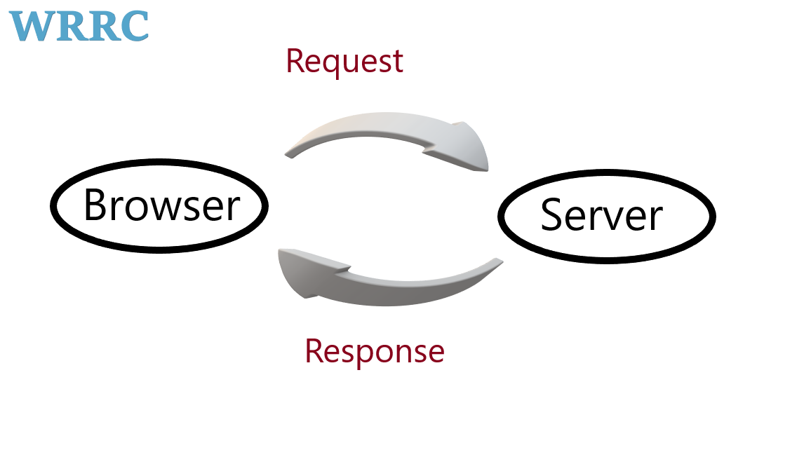

# Movies-Library

**Author Name**: Bashar Nidal

## WRRC

## Overview

## Getting Started
1. Clone this repository;
2. Run command "npm start" in terminal;
3. Go browser and write url "localhost:3000" or any port.

## Project Features
1. In home page (path "/") you can see the movies(title and poster and overview),

2. In favorite page (path '/favorite') you can see the favorite movies.

3. If you add any other path the error page not found is show .