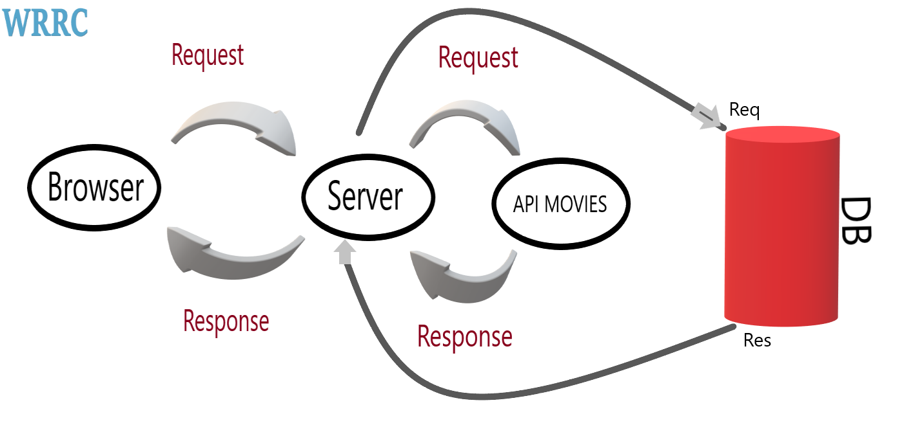

# Movies-Library

**Author Name**: Bashar Nidal

## WRRC

## Overview

This page is movies libray , I used Api movies database from [The movie Database API](https://developers.themoviedb.org/3/getting-started/introduction).

## Notes

- I used Api for request and response in project.

- I used  format clean code for my code.

- Postgresql.

## Getting Started

1. clone this repository;
2. run command "npm start" in terminal;
3. go browser and write url "localhost:3000".
4. add any path in project features (localhost:3000/path) to show the pages.

## Project Features

1. in home page (path "/") you can show the movies(title and poster and overview),

2. in favorite page (path "/favorite") you can show the favorite movies.

3. in page trending (path "/trending") you can show the request and response  trending page from movies database api;

4. in page search (path "/search") you can show the request and response  search page from movies database api

5. in page discover (path "/discover") you can show the request and response watch page from movies database api

6. In page watch (path "/watch") you can show the request and response watch page from database api

7. if you add any other path the error page not found is show .
API Docs
API Docs
Hosted API documentation for every OAS (Swagger) and RAML spec out there. Powered by Stoplight.io. Document, mock, test, and more, with the StopLight API Designer.

8. INSERT and GET data from to DB using postgresql.